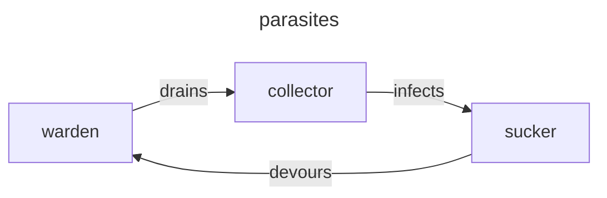

# parasites

In 'parasites' the player takes on the role of microscopic parasites battling for dominance within a host organism.  
The goal it to spread and thrive while avoiding eradication.

## gameplay

### objective

- control a part of the host organism
- thrive, spread and dominate while avoiding eradication

### grid movement

- game board consists of a grid representing parts of the host
- turn based movement
- players move their parasites one cell at a time
- movement is restricted to adjacent cells

### resources

- cells contain resources
  - nutrients, oxygen, etc.
- parasites move to consume resources (possibly different nutrients based on type)
  - nutrients let the parasites multiply
  - oxygen boosts movement
  - ...

### reproduction

- two parasites can merge with another of the same type to create another variant

### roshambo battles

- when two parasites occupy adjacent cells, a roshambo battle ensues
  - the loser is eliminated

### parasite types

there are three families of parasites, each having 3 merged stages representing a single roshambo type

- warden
  - paper-warden (default)
  - rock-warden
  - scissor-warden
- sucker
  - rock-sucker (default)
  - paper-sucker
  - scissor-sucker
- collector
  - scissor-collector (default)
  - rock-collector
  - paper-collector

## levels

### skin surface skirmish

### bloodstream battle

### blood-brain barrier blitz

### neural network showdown
